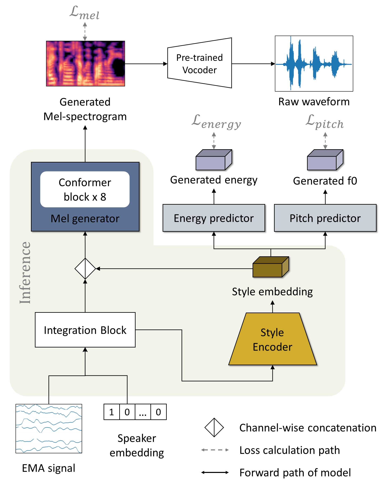

<h2>STYLE MODELING FOR MULTI-SPEAKER ARTICULATION-TO-SPEECH
</h2>

Submitted to ICASSP 2023 (Paper ID: 3227)

<h3>Authors
</h3>

Miseul Kim, Zhenyu Piao, Jihyun Lee, Hong-goo Kang

 

<h3>Proposed Method</h3>

In this paper, we propose a neural articulation-to-speech
(ATS) framework that synthesizes high-quality speech from
articulatory signal in a multi-speaker situation. Most conventional
ATS approaches only focus on modeling contextual information
of speech from a single speaker’s articulatory features.
To explicitly represent each speaker’s speaking style as
well as the contextual information, our proposed model estimates
style embeddings, guided from the essential speech
style attributes such as pitch and energy. We adopt convolutional
layers and transformer-based attention layers for our
model to fully utilize both local and global information of articulatory
signals, measured by electromagnetic articulography
(EMA). Our model significantly improves the quality of
synthesized speech compared to the baseline in terms of objective
and subjective measurements in the Haskins dataset.

 

<h3>Samples
</h3>

 <h4>Female (F03)</h4>

<table style="margin-left: auto; margin-right: auto;">
    <tr>
        <td>
        	Text
        </td>
        <td class="text">
            The wrist was badly strained and hung limp. 
        </td>
        <td class="text">
            The ink stain dried on the finished page.
        </td>
        <td class="text">
            The young kid jumped the rusty gate.
        </td>
        <td class="text">
            This plank was made for walking on.
        </td>
    </tr>
    <tr>
        <td class="first-col">Ground Truth</td>
        <td><audio controls="" preload="none"><source src="./assets/Samples_demo/F03/F03_B01_S36_R02_N_target.wav"></audio></td>
        <td><audio controls="" preload="none"><source src="./assets/Samples_demo/F03/F03_B02_S13_R02_N_target.wav"></audio></td>
        <td><audio controls="" preload="none"><source src="./assets/Samples_demo/F03/F03_B03_S21_R02_N_target.wav"></audio></td>
        <td><audio controls="" preload="none"><source src="./assets/Samples_demo/F03/F03_B07_S07_R01_N_target.wav"></audio></td>
    </tr>
    <tr>
        <td class="first-col">Baseline</td>
        <td><audio controls="" preload="none"><source src="./assets/Samples_demo/F03/baseline/F03_B01_S36_R02_N.wav"></audio></td>
        <td><audio controls="" preload="none"><source src="./assets/Samples_demo/F03/baseline/F03_B02_S13_R02_N.wav"></audio></td>
        <td><audio controls="" preload="none"><source src="./assets/Samples_demo/F03/baseline/F03_B03_S21_R02_N.wav"></audio></td>
        <td><audio controls="" preload="none"><source src="./assets/Samples_demo/F03/baseline/F03_B07_S07_R01_N.wav"></audio></td>
    </tr>
    <tr>
        <td class="first-col">Proposed</td>
        <td><audio controls="" preload="none"><source src="./assets/Samples_demo/F03/F03_B01_S36_R02_N.wav"></audio></td>
        <td><audio controls="" preload="none"><source src="./assets/Samples_demo/F03/F03_B02_S13_R02_N.wav"></audio></td>
        <td><audio controls="" preload="none"><source src="./assets/Samples_demo/F03/F03_B03_S21_R02_N.wav"></audio></td>
        <td><audio controls="" preload="none"><source src="./assets/Samples_demo/F03/F03_B07_S07_R01_N.wav"></audio></td>
    </tr>
</table>

 <h4>Male (M03)</h4>

<table style="margin-left: auto; margin-right: auto;">
    <tr>
        <td>
        	Text
        </td>
        <td class="text">
            Port is a strong wine with a smoky taste.
        </td>
        <td class="text">
            The office paint was a dull, sad tan.
        </td>
        <td class="text">
            They felt gay when the ship arrived in port.
        </td>
        <td class="text">
            Once we stood beside the shore.
        </td>
    </tr>
    <tr>
        <td class="first-col">Ground Truth</td>
        <td><audio controls="" preload="none"><source src="./assets/Samples_demo/M03/M03_B03_S20_R02_N_target.wav"></audio></td>
        <td><audio controls="" preload="none"><source src="./assets/Samples_demo/M03/M03_B03_S47_R01_N_target.wav"></audio></td>
        <td><audio controls="" preload="none"><source src="./assets/Samples_demo/M03/M03_B03_S59_R01_N_target.wav"></audio></td>
        <td><audio controls="" preload="none"><source src="./assets/Samples_demo/M03/M03_B07_S53_R01_N_target.wav"></audio></td>
    </tr>
    <tr>
        <td class="first-col">Baseline</td>
        <td><audio controls="" preload="none"><source src="./assets/Samples_demo/M03/baseline/M03_B03_S20_R02_N.wav"></audio></td>
        <td><audio controls="" preload="none"><source src="./assets/Samples_demo/M03/baseline/M03_B03_S47_R01_N.wav"></audio></td>
        <td><audio controls="" preload="none"><source src="./assets/Samples_demo/M03/baseline/M03_B03_S59_R01_N.wav"></audio></td>
        <td><audio controls="" preload="none"><source src="./assets/Samples_demo/M03/baseline/M03_B07_S53_R01_N.wav"></audio></td>
    </tr>
    <tr>
        <td class="first-col">Proposed</td>
        <td><audio controls="" preload="none"><source src="./assets/Samples_demo/M03/M03_B03_S20_R02_N.wav"></audio></td>
        <td><audio controls="" preload="none"><source src="./assets/Samples_demo/M03/M03_B03_S47_R01_N.wav"></audio></td>
        <td><audio controls="" preload="none"><source src="./assets/Samples_demo/M03/M03_B03_S59_R01_N.wav"></audio></td>
        <td><audio controls="" preload="none"><source src="./assets/Samples_demo/M03/M03_B07_S53_R01_N.wav"></audio></td>
    </tr>
</table>

 